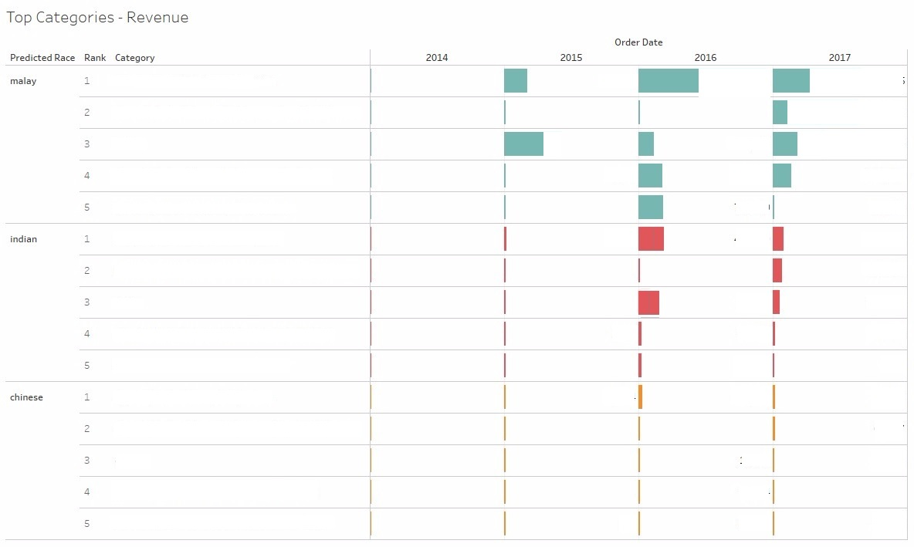

<h1> Name-based ethnic classificaction with 

tensorflow and Long Short Term Memory(LSTM)
</h1>

<h2>Motivation</h2>

To automate the classification of list of names by ethnic groups: Malay, Chinese and Indian

<h2>Use Case</h2>
When It comes to revenue, The graph shows the top 10 brands by Ethnic groups: Malay, Chinese and Indian

<h2>Data</h2>

I collected the total 12,623 numbers of unique names by each ethinic grop: Indian, Malay, Chinese

<h2>Methodology</h2>

<h3>1. Data preprocessing.</h3>

- It is about converting unstructured dataset(Alphabet) into structured format.
 

- Convert capital letters into small letters

- Change the characters into number(vectors)

&nbsp;&nbsp;&nbsp;&nbsp;&nbsp;&nbsp;*Alphabet consists of 26 characters.

&nbsp;&nbsp;&nbsp;&nbsp;&nbsp;&nbsp;*I gave each character the number from 0 to 26, including empty space.

- Padding: add zero(0) into the empty spaces per rows

&nbsp;&nbsp;&nbsp;&nbsp;&nbsp;&nbsp;*I set maximum number of alphabet as 40.
 
                                                      
- One hot encoding

&nbsp;&nbsp;&nbsp;&nbsp;&nbsp;&nbsp;*A term that is a representation of categorical variables as binary vectors.
 

<h3>2. Model</h3>

- LSTM

- batch issue: 100

- Dropout

&nbsp;&nbsp;&nbsp;&nbsp;&nbsp;&nbsp;*It helps to prevent LSTM models from overfitting.(rate=.5)
 

                                                                                         
<h2>Accuracy Rate</h2>                                                                                        
- 94% *test size: 3,786 (30% of total data)
 
                                                                                        
<h2>Reference</h2>

- https://github.com/hunkim/DeepLearningZeroToAll
 

- https://github.com/golbin/TensorFlow-Tutorials
 

- https://jasdeep06.github.io/posts/Understanding-LSTM-in-Tensorflow-MNIST/
 

